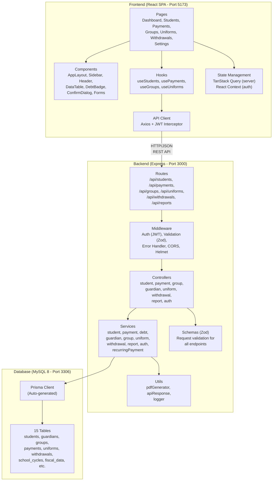
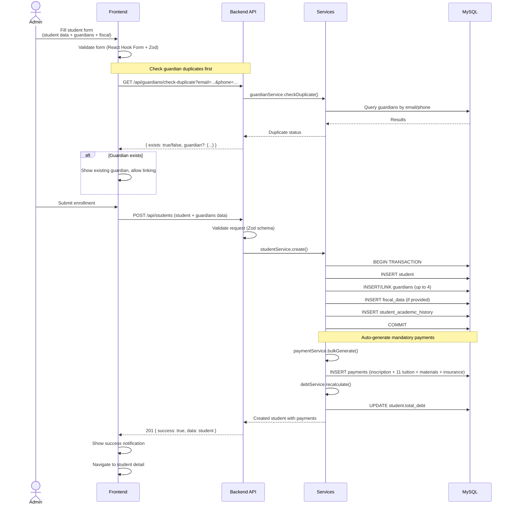
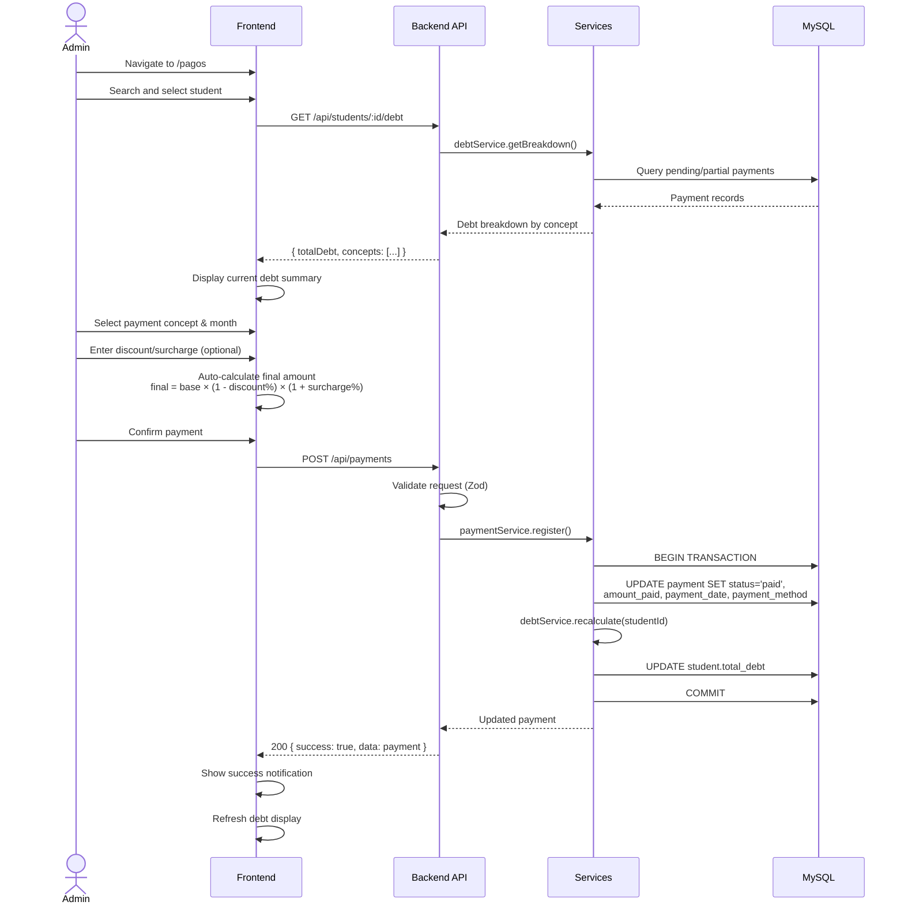
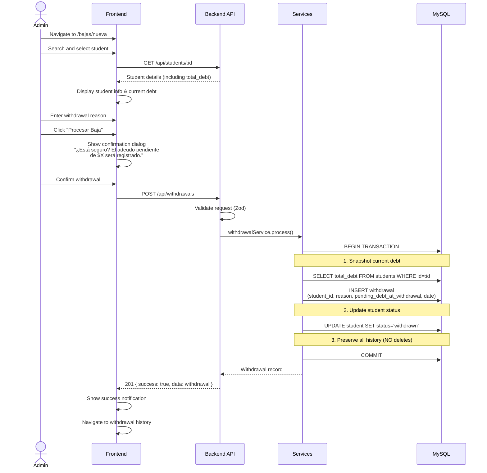
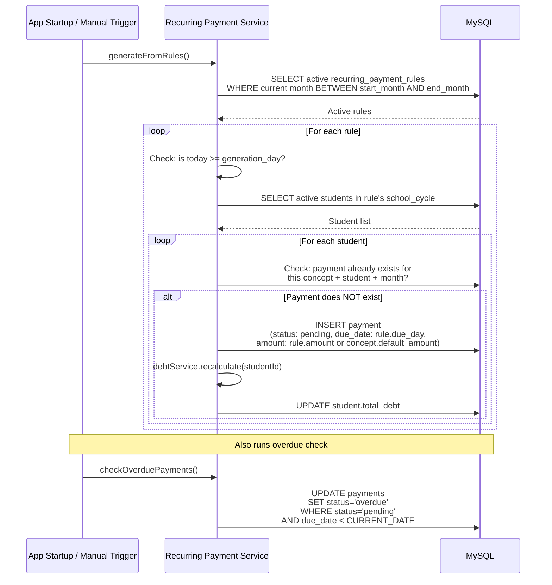
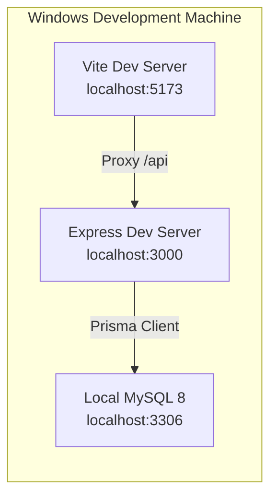
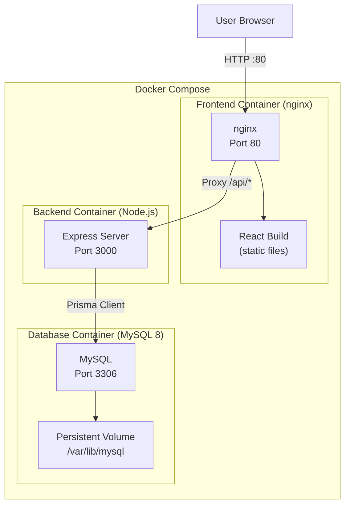

# Architecture Document — Sistema de Gestión Escolar

> **Maintenance note:** If the tech stack, architecture decisions, or deployment strategy change during development, update this document to reflect the current state.

## 1. Tech Stack

| Layer | Technology | Justification |
|-------|-----------|---------------|
| **Frontend** | React 19 + TypeScript + Vite 8 | React is the most widely adopted UI library with a vast ecosystem. TypeScript adds compile-time safety. Vite provides fast dev server and optimized builds. |
| **UI Library** | Material UI (MUI) v7 | Mature component library with built-in Spanish locale support, DataGrid for tables, date pickers, and a theming system for consistent branding. |
| **Forms** | React Hook Form + Zod | React Hook Form is performant (minimal re-renders). Zod provides schema-based validation that can be shared conceptually with backend validation. |
| **Server State** | TanStack Query (React Query) | Handles API data fetching, caching, background refetching, and cache invalidation — ideal for CRUD-heavy applications. Eliminates the need for Redux. |
| **Backend** | Node.js + Express + TypeScript | Express is the most established Node.js framework. TypeScript ensures type safety across the full stack. Lightweight and flexible for a layered architecture. |
| **ORM** | Prisma | Type-safe database client auto-generated from schema. Declarative migration system. Excellent MySQL support and developer experience. |
| **Database** | MySQL 8 | Robust relational database well-suited for structured educational/financial data. Widely supported with excellent tooling. |
| **Validation** | Zod | Single validation library used on both frontend (forms) and backend (request validation). Schema-first approach with TypeScript inference. |
| **PDF Generation** | pdfkit | Programmatic PDF creation without HTML templating overhead. Zero native dependencies. Produces professional documents. |
| **Auth** | JWT (jsonwebtoken + bcryptjs) | Stateless authentication suitable for a single-admin Phase 1 setup. Simple to implement and extend later for multi-user support. |
| **Date Picker** | MUI x-date-pickers v8 + dayjs | Calendar popup for date inputs. AdapterDayjs with `es` locale provides Spanish month/day names. Used in StudentCreate, StudentDetail, and SchoolCycleManagement. |
| **Charts** | Recharts | Composable chart library built on React and D3. Simple API for bar, line, and pie charts needed in the dashboard. |
| **HTTP Client** | Axios | Feature-rich HTTP client with interceptors for JWT attachment and error handling. Better DX than native fetch for complex scenarios. |
| **Testing** | Vitest | Native test framework for Vite/TypeScript projects. Used for backend integration tests on critical business logic (debt calculation, payment formulas, recurring rules). |

---

## 2. Architecture Overview

The system follows a **layered architecture** (n-tier) with three distinct tiers and a clear separation of concerns.

### Layered Architecture

```
┌─────────────────────────────────────────────────────────────┐
│                    PRESENTATION TIER                         │
│                                                             │
│  Frontend (React SPA)           Backend (Express)           │
│  ┌─────────────────┐           ┌──────────────────┐        │
│  │ Pages & Components│          │ Routes            │        │
│  │ React Hook Form  │  HTTP    │ Controllers       │        │
│  │ TanStack Query   │ ──────► │ Middleware         │        │
│  │ MUI Components   │  JSON   │  (auth, validation)│        │
│  └─────────────────┘           └──────────────────┘        │
│                                         │                   │
├─────────────────────────────────────────┼───────────────────┤
│                    BUSINESS LOGIC TIER   │                   │
│                                         ▼                   │
│                                ┌──────────────────┐        │
│                                │ Services          │        │
│                                │  - Debt calc      │        │
│                                │  - Payment gen    │        │
│                                │  - PDF reports    │        │
│                                │  - Overdue check  │        │
│                                └──────────────────┘        │
│                                         │                   │
├─────────────────────────────────────────┼───────────────────┤
│                    DATA ACCESS TIER     │                   │
│                                         ▼                   │
│                                ┌──────────────────┐        │
│                                │ Prisma Client     │        │
│                                │ (Type-safe ORM)   │        │
│                                └──────────────────┘        │
│                                         │                   │
│                                         ▼                   │
│                                ┌──────────────────┐        │
│                                │ MySQL 8           │        │
│                                │ (15 tables)       │        │
│                                └──────────────────┘        │
└─────────────────────────────────────────────────────────────┘
```

**Layer responsibilities:**

| Layer | Components | Responsibility |
|-------|-----------|----------------|
| **Presentation** | Routes, Controllers, Middleware | Parse HTTP requests, authenticate, validate input, format responses. No business logic. |
| **Business Logic** | Services | All business rules: debt calculation, payment generation, withdrawal processing, PDF generation, overdue checks. |
| **Data Access** | Prisma Client | Type-safe database queries, migrations, seeding. Auto-generated from `schema.prisma`. |

### UI Conventions

- **Dark theme**: Navy palette (#0B0F1A background, #111827 paper, #29B6F6 cyan accent). Shadows over borders.
- **Server-side sorting**: All list endpoints accept `?sortBy=field&sortDir=asc|desc`. Sort is validated against an allowlist per endpoint, applied via Prisma `orderBy`, and works across all pages.
- **Pagination**: All list endpoints accept `?page=1&limit=20`. Default 20 rows per page.
- **Design principles**: Font smoothing (antialiased), tabular-nums on numbers, text-wrap balance on headings, scale-on-press (0.96) for buttons, min 40px hit areas.
- **`noGroup` filter**: List endpoints that reference groups accept `?noGroup=true` to return records with `groupId IS NULL`. Takes precedence over `groupId` param. Exposed in StudentList as "Sin grupo" option in the group dropdown.

---

## 3. Component Diagram



---

## 4. Main Flows

### 4.1 Student Enrollment Flow



### 4.2 Payment Registration Flow



### 4.3 Student Withdrawal Flow



### 4.4 Recurring Payment Generation Flow



---

## 5. Deployment Architecture

### Development Environment (Windows)



### Production Environment (macOS + Docker)



### Docker Compose Services

| Service | Image | Port | Purpose |
|---------|-------|------|---------|
| `frontend` | Custom (nginx + React build) | 80 → 80 | Serves SPA, proxies API requests |
| `backend` | Custom (Node.js) | 3000 (internal) | REST API server |
| `mysql` | mysql:8 | 3306 (internal) | Database with persistent volume |

**Key configuration:**
- Frontend nginx proxies `/api/*` requests to the backend container
- MySQL data persisted via Docker volume (survives container restarts)
- Environment variables injected via `.env` file
- Backend runs Prisma migrations on container startup
