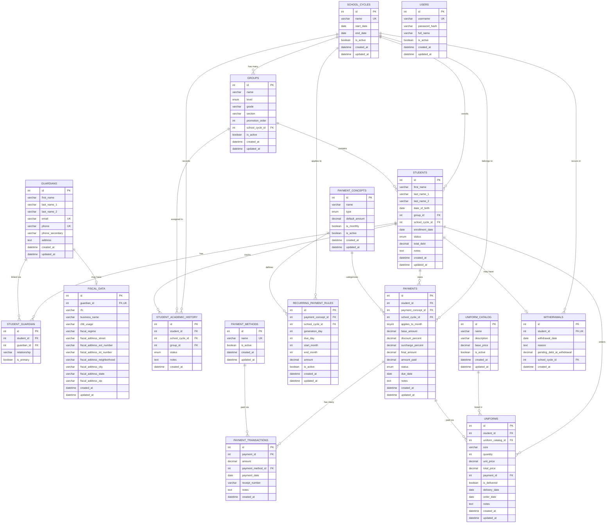

# Data Models — Sistema de Gestión Escolar

> **Maintenance note:** If the database schema, relationships, or business rules change during development, update this document to reflect the current state.

## Entity Relationship Diagram

---

## Entity Definitions

### 1. school_cycles

Represents an academic year period (e.g., "2025-2026"). All groups, students, and payments are tied to a specific cycle.

| Column | Type | Nullable | Default | Description |
|--------|------|----------|---------|-------------|
| `id` | INT | No | AUTO_INCREMENT | Primary key |
| `name` | VARCHAR(50) | No | — | Unique cycle name, e.g. "2025-2026" |
| `start_date` | DATE | No | — | Cycle start date |
| `end_date` | DATE | No | — | Cycle end date |
| `is_active` | BOOLEAN | No | `false` | Only one cycle should be active at a time |
| `created_at` | DATETIME | No | `NOW()` | Record creation timestamp |
| `updated_at` | DATETIME | No | Auto-update | Last modification timestamp |

**Constraints:**
- `name` is UNIQUE
- Only one cycle should have `is_active = true` (enforced in service layer)

**Business Rules:**
- When activating a cycle, all other cycles are deactivated
- `end_date` must be after `start_date`

---

### 2. groups

Represents a student group within a school cycle. Groups have a level (kinder, primaria, etc.), a numeric grade, and a section letter.

| Column | Type | Nullable | Default | Description |
|--------|------|----------|---------|-------------|
| `id` | INT | No | AUTO_INCREMENT | Primary key |
| `name` | VARCHAR(50) | No | — | Display name, e.g. "1-A" |
| `level` | ENUM | No | — | Education level (see enum below) |
| `grade` | VARCHAR(10) | No | — | Numeric grade within level, e.g. "1", "2", "3" |
| `section` | VARCHAR(10) | No | — | Section letter, e.g. "A", "B" |
| `promotion_order` | INT | No | — | Hierarchical order using gap formula: `levelIndex * 1000 + grade * 10 + sectionIndex` |
| `school_cycle_id` | INT (FK) | No | — | References `school_cycles.id` |
| `is_active` | BOOLEAN | No | `true` | Whether the group is currently active |
| `created_at` | DATETIME | No | `NOW()` | Record creation timestamp |
| `updated_at` | DATETIME | No | Auto-update | Last modification timestamp |

**Constraints:**
- UNIQUE: (`level`, `grade`, `section`, `school_cycle_id`)
- `school_cycle_id` references `school_cycles.id`

**Business Rules:**
- `promotion_order` uses a gap formula (`levelIndex * 1000 + grade * 10 + sectionIndex`) so new groups slot in without recalculating existing ones
- Groups are tied to a specific school cycle; new cycles require recreating groups

---

### 3. students

Core entity representing an enrolled student. Contains personal data, current group assignment, enrollment status, and cached debt total.

| Column | Type | Nullable | Default | Description |
|--------|------|----------|---------|-------------|
| `id` | INT | No | AUTO_INCREMENT | Primary key |
| `first_name` | VARCHAR(100) | No | — | Student's first name(s) |
| `last_name_1` | VARCHAR(100) | No | — | Paternal last name (apellido paterno) |
| `last_name_2` | VARCHAR(100) | Yes | `NULL` | Maternal last name (apellido materno) |
| `date_of_birth` | DATE | No | — | Date of birth |
| `group_id` | INT (FK) | Yes | `NULL` | Current group assignment (null if unassigned) |
| `school_cycle_id` | INT (FK) | No | — | Current school cycle |
| `enrollment_date` | DATE | No | — | Date of enrollment |
| `status` | ENUM | No | `'active'` | Student status (see enum below) |
| `total_debt` | DECIMAL(10,2) | No | `0.00` | Cached total debt amount |
| `notes` | TEXT | Yes | `NULL` | Additional notes |
| `created_at` | DATETIME | No | `NOW()` | Record creation timestamp |
| `updated_at` | DATETIME | No | Auto-update | Last modification timestamp |

**Constraints:**
- `group_id` references `groups.id`
- `school_cycle_id` references `school_cycles.id`

**Business Rules:**
- `total_debt` is a cached value, recalculated whenever payments or transactions change: `SUM(final_amount - amount_paid) WHERE status IN ('pending', 'partial', 'overdue')`
- When status changes to `withdrawn`, a withdrawal record must be created
- Student records are never physically deleted (soft delete via status)

---

### 4. guardians

Represents a parent or guardian of one or more students. Contains contact information used for duplicate detection.

| Column | Type | Nullable | Default | Description |
|--------|------|----------|---------|-------------|
| `id` | INT | No | AUTO_INCREMENT | Primary key |
| `first_name` | VARCHAR(100) | No | — | Guardian's first name(s) |
| `last_name_1` | VARCHAR(100) | No | — | Paternal last name |
| `last_name_2` | VARCHAR(100) | Yes | `NULL` | Maternal last name |
| `email` | VARCHAR(255) | Yes | `NULL` | Email address (for duplicate detection) |
| `phone` | VARCHAR(20) | No | — | Primary phone number (for duplicate detection) |
| `phone_secondary` | VARCHAR(20) | Yes | `NULL` | Secondary phone number |
| `address` | TEXT | Yes | `NULL` | Home address |
| `created_at` | DATETIME | No | `NOW()` | Record creation timestamp |
| `updated_at` | DATETIME | No | Auto-update | Last modification timestamp |

**Constraints:**
- `email` is UNIQUE (nullable — only checked when provided)
- `phone` is UNIQUE

**Business Rules:**
- Before creating a new guardian, check for duplicates by email or phone
- A guardian can be associated with multiple students
- A student can have up to 4 guardians (enforced in service layer via `student_guardian`)

---

### 5. student_guardian

Junction table linking students to their guardians. Supports up to 4 guardians per student.

| Column | Type | Nullable | Default | Description |
|--------|------|----------|---------|-------------|
| `id` | INT | No | AUTO_INCREMENT | Primary key |
| `student_id` | INT (FK) | No | — | References `students.id` |
| `guardian_id` | INT (FK) | No | — | References `guardians.id` |
| `relationship` | VARCHAR(50) | No | — | e.g. "Padre", "Madre", "Tutor", "Abuelo/a" |
| `is_primary` | BOOLEAN | No | `false` | Whether this is the primary contact |

**Constraints:**
- UNIQUE: (`student_id`, `guardian_id`)
- `student_id` references `students.id`
- `guardian_id` references `guardians.id`

**Business Rules:**
- Maximum 4 guardians per student (enforced in service layer)
- At least one guardian must be marked as `is_primary = true`

---

### 6. fiscal_data

Tax/billing information associated with a guardian. Used for invoice generation (CFDI in the Mexican tax system).

| Column | Type | Nullable | Default | Description |
|--------|------|----------|---------|-------------|
| `id` | INT | No | AUTO_INCREMENT | Primary key |
| `guardian_id` | INT (FK) | No | — | References `guardians.id` (one-to-one) |
| `rfc` | VARCHAR(13) | No | — | Mexican tax ID (RFC) |
| `business_name` | VARCHAR(255) | No | — | Razón social |
| `cfdi_usage` | VARCHAR(100) | No | — | CFDI usage code (e.g. "G03 - Gastos en general") |
| `fiscal_regime` | VARCHAR(100) | Yes | `NULL` | Régimen fiscal |
| `fiscal_address_street` | VARCHAR(255) | No | — | Street name |
| `fiscal_address_ext_number` | VARCHAR(20) | Yes | `NULL` | External number |
| `fiscal_address_int_number` | VARCHAR(20) | Yes | `NULL` | Internal number |
| `fiscal_address_neighborhood` | VARCHAR(100) | Yes | `NULL` | Colonia |
| `fiscal_address_city` | VARCHAR(100) | No | — | City |
| `fiscal_address_state` | VARCHAR(100) | No | — | State |
| `fiscal_address_zip` | VARCHAR(10) | No | — | Postal code |
| `created_at` | DATETIME | No | `NOW()` | Record creation timestamp |
| `updated_at` | DATETIME | No | Auto-update | Last modification timestamp |

**Constraints:**
- `guardian_id` is UNIQUE (one-to-one with guardians)
- `guardian_id` references `guardians.id`

**Business Rules:**
- Fiscal data is optional; not all guardians need it
- RFC must follow the Mexican RFC format (12-13 characters)

---

### 7. student_academic_history

Tracks which group a student was assigned to in each school cycle, along with their academic outcome.

| Column | Type | Nullable | Default | Description |
|--------|------|----------|---------|-------------|
| `id` | INT | No | AUTO_INCREMENT | Primary key |
| `student_id` | INT (FK) | No | — | References `students.id` |
| `school_cycle_id` | INT (FK) | No | — | References `school_cycles.id` |
| `group_id` | INT (FK) | No | — | References `groups.id` |
| `status` | ENUM | No | — | Academic outcome (see enum below) |
| `notes` | TEXT | Yes | `NULL` | Additional notes |
| `created_at` | DATETIME | No | `NOW()` | Record creation timestamp |

**Constraints:**
- UNIQUE: (`student_id`, `school_cycle_id`) — one record per student per cycle
- Foreign keys to `students`, `school_cycles`, and `groups`

**Business Rules:**
- A new record is created when a student enrolls or is promoted
- Records are preserved even after student withdrawal

---

### 8. payment_methods

Catalog of standardized payment methods. Used for filtering payments by method and for reporting.

| Column | Type | Nullable | Default | Description |
|--------|------|----------|---------|-------------|
| `id` | INT | No | AUTO_INCREMENT | Primary key |
| `name` | VARCHAR(50) | No | — | Method name, e.g. "Efectivo", "Transferencia", "Tarjeta" |
| `is_active` | BOOLEAN | No | `true` | Whether the method is available for selection |
| `created_at` | DATETIME | No | `NOW()` | Record creation timestamp |
| `updated_at` | DATETIME | No | Auto-update | Last modification timestamp |

**Constraints:**
- `name` is UNIQUE

**Business Rules:**
- Default seed data: Efectivo, Transferencia, Tarjeta
- Deactivated methods cannot be selected for new transactions but existing transactions retain the reference

---

### 9. payment_concepts

Defines the types of payments that can be registered (e.g., tuition, inscription, materials).

| Column | Type | Nullable | Default | Description |
|--------|------|----------|---------|-------------|
| `id` | INT | No | AUTO_INCREMENT | Primary key |
| `name` | VARCHAR(100) | No | — | Concept name, e.g. "Colegiatura", "Inscripción" |
| `type` | ENUM | No | — | Mandatory or optional (see enum below) |
| `default_amount` | DECIMAL(10,2) | No | — | Default payment amount |
| `is_monthly` | BOOLEAN | No | `false` | Whether this is a monthly recurring payment |
| `is_active` | BOOLEAN | No | `true` | Whether this concept is currently in use |
| `created_at` | DATETIME | No | `NOW()` | Record creation timestamp |
| `updated_at` | DATETIME | No | Auto-update | Last modification timestamp |

**Business Rules:**
- Mandatory concepts are auto-generated when a student enrolls
- `is_monthly = true` indicates the concept applies once per month (e.g., tuition)
- Default seed data: Inscripción, Colegiatura (monthly), Material, Seguro

---

### 10. recurring_payment_rules

Configurable rules that determine when payment records are automatically generated for students.

| Column | Type | Nullable | Default | Description |
|--------|------|----------|---------|-------------|
| `id` | INT | No | AUTO_INCREMENT | Primary key |
| `payment_concept_id` | INT (FK) | No | — | References `payment_concepts.id` |
| `school_cycle_id` | INT (FK) | No | — | References `school_cycles.id` |
| `generation_day` | INT | No | — | Day of month to generate payment (1-28) |
| `due_day` | INT | No | — | Day of month for payment deadline (1-28) |
| `start_month` | INT | No | — | First month the rule applies (1-12) |
| `end_month` | INT | No | — | Last month the rule applies (1-12) |
| `amount` | DECIMAL(10,2) | Yes | `NULL` | Override amount (NULL = use concept default) |
| `is_active` | BOOLEAN | No | `true` | Whether the rule is active |
| `created_at` | DATETIME | No | `NOW()` | Record creation timestamp |
| `updated_at` | DATETIME | No | Auto-update | Last modification timestamp |

**Constraints:**
- `payment_concept_id` references `payment_concepts.id`
- `school_cycle_id` references `school_cycles.id`

**Business Rules:**
- On app startup (or manual trigger), the system checks active rules
- For each rule where the current date matches or exceeds `generation_day` in the current month, payment records are created for all active students in the rule's school cycle
- Duplicate payments are not created (checked via unique constraint on payments table)
- `start_month` and `end_month` can wrap around the year (e.g., start=8, end=6 means August through June)

---

### 11. payments

Individual payment records for each student. Tracks amounts, discounts, surcharges, status, and due dates. Actual money received is tracked via `payment_transactions`.

| Column | Type | Nullable | Default | Description |
|--------|------|----------|---------|-------------|
| `id` | INT | No | AUTO_INCREMENT | Primary key |
| `student_id` | INT (FK) | No | — | References `students.id` |
| `payment_concept_id` | INT (FK) | No | — | References `payment_concepts.id` |
| `school_cycle_id` | INT (FK) | No | — | References `school_cycles.id` |
| `applies_to_month` | TINYINT | Yes | `NULL` | Month this payment applies to (1-12), for monthly concepts |
| `base_amount` | DECIMAL(10,2) | No | — | Original amount before adjustments |
| `discount_percent` | DECIMAL(5,2) | No | `0.00` | Discount percentage applied |
| `surcharge_percent` | DECIMAL(5,2) | No | `0.00` | Surcharge/late fee percentage |
| `final_amount` | DECIMAL(10,2) | No | — | Calculated: `base × (1 - discount%) × (1 + surcharge%)` |
| `amount_paid` | DECIMAL(10,2) | No | `0.00` | Cached sum of all transaction amounts |
| `status` | ENUM | No | `'pending'` | Payment status (see enum below) |
| `due_date` | DATE | Yes | `NULL` | Payment deadline date |
| `notes` | TEXT | Yes | `NULL` | Additional notes |
| `created_at` | DATETIME | No | `NOW()` | Record creation timestamp |
| `updated_at` | DATETIME | No | Auto-update | Last modification timestamp |

**Constraints:**
- UNIQUE: (`student_id`, `payment_concept_id`, `school_cycle_id`, `applies_to_month`) — prevents duplicate payments
- Foreign keys to `students`, `payment_concepts`, `school_cycles`

**Business Rules:**
- `final_amount = base_amount × (1 - discount_percent/100) × (1 + surcharge_percent/100)` (multiplicative formula)
- `amount_paid` is a cached value recalculated as `SUM(transaction.amount)` whenever transactions change
- Status is auto-determined: `paid` (amountPaid >= finalAmount), `overdue` (dueDate < today and not fully paid), `partial` (amountPaid > 0 and < finalAmount), `pending` (default). `cancelled` is set only manually.
- When `status` changes, `student.total_debt` must be recalculated
- `overdue` status is also set via periodic check (checkOverdue) for pending payments past due date
- The "reset" operation deletes all payment records (cascading to transactions) and sets `total_debt = 0`
- Overpayment is blocked: transaction amount cannot exceed remaining balance (`finalAmount - amountPaid`)

---

### 12. payment_transactions

Individual installment/payment records against a payment. Supports partial payments and tracks which method was used for each transaction.

| Column | Type | Nullable | Default | Description |
|--------|------|----------|---------|-------------|
| `id` | INT | No | AUTO_INCREMENT | Primary key |
| `payment_id` | INT (FK) | No | — | References `payments.id` |
| `amount` | DECIMAL(10,2) | No | — | Amount of this transaction |
| `payment_method_id` | INT (FK) | No | — | References `payment_methods.id` |
| `payment_date` | DATE | No | — | Date payment was received |
| `receipt_number` | VARCHAR(50) | Yes | `NULL` | Receipt or reference number |
| `notes` | TEXT | Yes | `NULL` | Additional notes |
| `created_at` | DATETIME | No | `NOW()` | Record creation timestamp |

**Constraints:**
- `payment_id` references `payments.id` (CASCADE on delete)
- `payment_method_id` references `payment_methods.id` (RESTRICT on delete)

**Business Rules:**
- When a transaction is created or deleted, `payment.amount_paid` is recalculated as `SUM(amount)`
- After recalculating `amount_paid`, the payment status is re-determined and `student.total_debt` is updated
- Transaction amount must not exceed remaining balance (`payment.final_amount - payment.amount_paid`)
- Deleting a payment cascades to all its transactions
- Transactions are immutable (no update, only create/delete)

---

### 13. uniform_catalog

Reference table for available uniform items and their prices.

| Column | Type | Nullable | Default | Description |
|--------|------|----------|---------|-------------|
| `id` | INT | No | AUTO_INCREMENT | Primary key |
| `name` | VARCHAR(100) | No | — | Item name, e.g. "Playera polo", "Pantalón" |
| `description` | VARCHAR(255) | Yes | `NULL` | Additional description |
| `base_price` | DECIMAL(10,2) | No | — | Standard price |
| `is_active` | BOOLEAN | No | `true` | Whether the item is currently available |
| `created_at` | DATETIME | No | `NOW()` | Record creation timestamp |
| `updated_at` | DATETIME | No | Auto-update | Last modification timestamp |

**Business Rules:**
- Prices can be updated; existing orders retain the price at time of purchase (`unit_price` in `uniforms`)
- Deactivated items cannot be ordered but existing orders are preserved

---

### 14. uniforms

Individual uniform orders/purchases linked to students. Tracks order details and delivery status.

| Column | Type | Nullable | Default | Description |
|--------|------|----------|---------|-------------|
| `id` | INT | No | AUTO_INCREMENT | Primary key |
| `student_id` | INT (FK) | No | — | References `students.id` |
| `uniform_catalog_id` | INT (FK) | No | — | References `uniform_catalog.id` |
| `size` | VARCHAR(20) | No | — | Size, e.g. "CH", "M", "G", "4", "6" |
| `quantity` | INT | No | `1` | Number of items ordered |
| `unit_price` | DECIMAL(10,2) | No | — | Price per item at time of order |
| `total_price` | DECIMAL(10,2) | No | — | `quantity × unit_price` |
| `payment_id` | INT (FK) | Yes | `NULL` | Optional link to associated payment |
| `is_delivered` | BOOLEAN | No | `false` | Whether the uniform has been delivered |
| `delivery_date` | DATE | Yes | `NULL` | Date of delivery |
| `order_date` | DATE | No | — | Date the order was placed |
| `notes` | TEXT | Yes | `NULL` | Additional notes |
| `created_at` | DATETIME | No | `NOW()` | Record creation timestamp |
| `updated_at` | DATETIME | No | Auto-update | Last modification timestamp |

**Constraints:**
- Foreign keys to `students`, `uniform_catalog`, `payments` (optional)

**Business Rules:**
- `unit_price` is captured at order time (not dynamically linked to catalog price)
- `total_price = quantity × unit_price`
- Delivery is tracked separately: `is_delivered` flips to `true` when marked, and `delivery_date` is recorded
- Multiple uniform items can be ordered in a single operation

---

### 15. withdrawals

Records the withdrawal (baja) of a student, including the reason and a snapshot of their debt at the time.

| Column | Type | Nullable | Default | Description |
|--------|------|----------|---------|-------------|
| `id` | INT | No | AUTO_INCREMENT | Primary key |
| `student_id` | INT (FK) | No | — | References `students.id` |
| `withdrawal_date` | DATE | No | — | Date of withdrawal |
| `reason` | TEXT | No | — | Reason for withdrawal |
| `pending_debt_at_withdrawal` | DECIMAL(10,2) | No | — | Snapshot of student's debt at withdrawal |
| `school_cycle_id` | INT (FK) | No | — | Cycle during which the withdrawal occurred |
| `created_at` | DATETIME | No | `NOW()` | Record creation timestamp |

**Constraints:**
- `student_id` is UNIQUE (one withdrawal per student)
- Foreign keys to `students`, `school_cycles`

**Business Rules:**
- Creating a withdrawal changes `student.status` to `'withdrawn'`
- `pending_debt_at_withdrawal` is a snapshot — it does NOT change if payments are later modified
- Academic history and payment records are preserved (no cascading deletes)

---

### 16. users

System users for authentication. Phase 1 supports a single admin account.

| Column | Type | Nullable | Default | Description |
|--------|------|----------|---------|-------------|
| `id` | INT | No | AUTO_INCREMENT | Primary key |
| `username` | VARCHAR(50) | No | — | Login username |
| `password_hash` | VARCHAR(255) | No | — | bcrypt-hashed password |
| `full_name` | VARCHAR(200) | No | — | Display name |
| `is_active` | BOOLEAN | No | `true` | Whether the account is active |
| `created_at` | DATETIME | No | `NOW()` | Record creation timestamp |
| `updated_at` | DATETIME | No | Auto-update | Last modification timestamp |

**Constraints:**
- `username` is UNIQUE

**Business Rules:**
- Passwords are hashed with bcrypt (12 rounds)
- A default admin user is created by the seed script
- Phase 1 has a single admin; multi-user with roles is deferred to a future phase

---

## Enums

### StudentStatus

| Value | Description |
|-------|-------------|
| `active` | Currently enrolled and attending |
| `inactive` | Temporarily inactive (not withdrawn) |
| `withdrawn` | Officially withdrawn from the institution |

### GroupLevel

| Value | Description |
|-------|-------------|
| `kinder` | Kindergarten / preschool |
| `primaria` | Elementary school |
| `secundaria` | Middle school |
| `prepa` | High school / preparatoria |

### AcademicStatus

| Value | Description |
|-------|-------------|
| `enrolled` | Currently enrolled in this cycle |
| `promoted` | Successfully promoted to next grade |
| `withdrawn` | Withdrawn during this cycle |
| `repeated` | Repeating this grade |

### PaymentConceptType

| Value | Description |
|-------|-------------|
| `mandatory` | Required payment (inscription, tuition, materials, insurance) |
| `optional` | Elective payment (uniforms, extracurricular activities) |

### PaymentStatus

| Value | Description |
|-------|-------------|
| `pending` | Payment not yet made, not past due |
| `paid` | Fully paid |
| `partial` | Partially paid (amount_paid < final_amount) |
| `overdue` | Past due date and not paid |
| `cancelled` | Payment cancelled/voided |

---

## Relationship Summary

| Relationship | Type | Description |
|-------------|------|-------------|
| school_cycles → groups | 1:N | A cycle contains many groups |
| school_cycles → students | 1:N | Students are enrolled in a cycle |
| groups → students | 1:N | A group contains many students |
| students ↔ guardians | N:M | Via `student_guardian` (max 4 per student) |
| guardians → fiscal_data | 1:1 | Optional fiscal/tax information |
| students → student_academic_history | 1:N | One record per cycle |
| students → payments | 1:N | All payment records for a student |
| students → uniforms | 1:N | All uniform orders for a student |
| students → withdrawals | 1:0..1 | Optional withdrawal record |
| payments → payment_transactions | 1:N | Individual installments/partial payments |
| payment_methods → payment_transactions | 1:N | Method used for each transaction |
| payment_concepts → payments | 1:N | Concept categorizes payments |
| payment_concepts → recurring_payment_rules | 1:N | Rules define auto-generation |
| uniform_catalog → uniforms | 1:N | Catalog item referenced in orders |
| payments → uniforms | 1:N | Optional payment link for uniform orders |
