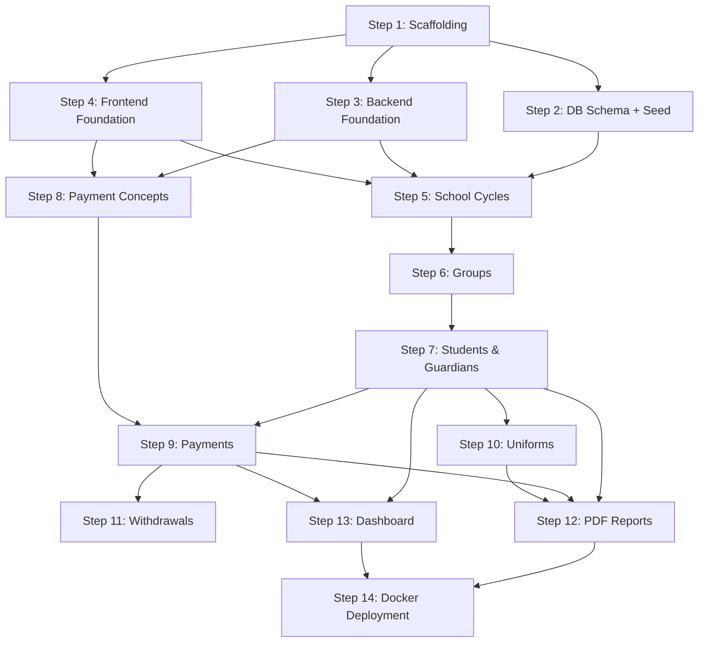

# Implementation Plan — Sistema de Gestión Escolar (Phase 1)

## Overview

Build Phase 1 of a school management system covering: student/guardian management, group management, payment registration with recurring rules, uniforms, student withdrawals, PDF reports, and a dashboard with charts.

**Key constraints:**
- Development: Windows + local MySQL
- Deployment: macOS + full Docker Compose
- Single admin user (no roles)
- Spanish UI labels, English code/variables/comments

---

## Tech Stack Summary

| Layer | Technology |
|-------|-----------|
| Frontend | React 18 + TypeScript + Vite |
| UI Library | Material UI (MUI) v5 |
| Forms | React Hook Form + Zod |
| Server State | TanStack Query (React Query) |
| Charts | Recharts |
| Backend | Node.js + Express + TypeScript |
| ORM | Prisma |
| Database | MySQL 8 |
| Validation | Zod |
| PDF | pdfkit |
| Auth | JWT + bcryptjs |

---

## Database Schema (14 Tables)

| Table | Purpose | Key Relationships |
|-------|---------|-------------------|
| `school_cycles` | Academic year periods | Parent of groups, students, payments |
| `groups` | Student groups with level/grade/section | Belongs to cycle, contains students |
| `students` | Enrolled students | Belongs to group + cycle, has payments/uniforms |
| `guardians` | Parents/tutors | Many-to-many with students (max 4) |
| `student_guardian` | Student-guardian junction | Links students ↔ guardians |
| `fiscal_data` | Tax/billing info | One-to-one with guardian |
| `student_academic_history` | Grade history per cycle | One per student per cycle |
| `payment_concepts` | Payment type definitions | Referenced by payments |
| `recurring_payment_rules` | Auto-generation rules | Defines when payments are created |
| `payments` | Individual payment records | Belongs to student + concept + cycle |
| `uniform_catalog` | Available uniform items | Referenced by uniform orders |
| `uniforms` | Uniform orders/purchases | Belongs to student + catalog item |
| `withdrawals` | Student withdrawal records | One per student (optional) |
| `users` | System authentication | Single admin for Phase 1 |

> Full schema details in [data-models.md](./data-models.md)

---

## API Endpoints

### Auth (2 endpoints)
| Method | Path | Description |
|--------|------|-------------|
| POST | `/api/auth/login` | Login, returns JWT |
| GET | `/api/auth/me` | Current user info |

### School Cycles (4 endpoints)
| Method | Path | Description |
|--------|------|-------------|
| GET | `/api/school-cycles` | List all cycles |
| POST | `/api/school-cycles` | Create cycle |
| PUT | `/api/school-cycles/:id` | Update cycle |
| PATCH | `/api/school-cycles/:id/activate` | Set as active cycle |

### Groups (4 endpoints)
| Method | Path | Description |
|--------|------|-------------|
| GET | `/api/groups` | List groups (filter by cycle) |
| POST | `/api/groups` | Create group |
| PUT | `/api/groups/:id` | Update group |
| GET | `/api/groups/:id/students` | List students in group |

### Students (8 endpoints)
| Method | Path | Description |
|--------|------|-------------|
| GET | `/api/students` | List students (search, filter) |
| POST | `/api/students` | Create student with guardians |
| GET | `/api/students/:id` | Student detail |
| PUT | `/api/students/:id` | Update student |
| GET | `/api/students/:id/payments` | Payment history |
| GET | `/api/students/:id/uniforms` | Uniform orders |
| GET | `/api/students/:id/debt` | Detailed debt breakdown |
| GET | `/api/students/:id/academic-history` | Academic history |

### Guardians (6 endpoints)
| Method | Path | Description |
|--------|------|-------------|
| GET | `/api/guardians` | List guardians (search) |
| POST | `/api/guardians` | Create guardian |
| GET | `/api/guardians/:id` | Guardian detail |
| PUT | `/api/guardians/:id` | Update guardian |
| POST | `/api/guardians/:id/fiscal-data` | Create/update fiscal data |
| GET | `/api/guardians/check-duplicate` | Check email/phone existence |

### Payment Concepts (3 endpoints)
| Method | Path | Description |
|--------|------|-------------|
| GET | `/api/payment-concepts` | List all concepts |
| POST | `/api/payment-concepts` | Create concept |
| PUT | `/api/payment-concepts/:id` | Update concept |

### Payments (5 endpoints)
| Method | Path | Description |
|--------|------|-------------|
| GET | `/api/payments` | List payments (filter by student, status, cycle, month) |
| POST | `/api/payments` | Register a payment |
| PUT | `/api/payments/:id` | Update payment |
| POST | `/api/payments/bulk-generate` | Auto-generate mandatory payments for student/cycle |
| DELETE | `/api/payments/student/:id/reset` | Reset all payments for a student (sets debt to 0) |

### Recurring Payment Rules (4 endpoints)
| Method | Path | Description |
|--------|------|-------------|
| GET | `/api/recurring-rules` | List rules |
| POST | `/api/recurring-rules` | Create rule |
| PUT | `/api/recurring-rules/:id` | Update rule |
| DELETE | `/api/recurring-rules/:id` | Delete rule |
| POST | `/api/recurring-rules/generate` | Manually trigger payment generation |

### Overdue Check (1 endpoint)
| Method | Path | Description |
|--------|------|-------------|
| POST | `/api/payments/check-overdue` | Scan and mark overdue payments |

### Uniforms (6 endpoints)
| Method | Path | Description |
|--------|------|-------------|
| GET | `/api/uniforms/catalog` | List catalog items |
| POST | `/api/uniforms/catalog` | Add catalog item |
| PUT | `/api/uniforms/catalog/:id` | Update catalog item |
| POST | `/api/uniforms/orders` | Create uniform order (multiple items) |
| GET | `/api/uniforms/orders` | List orders (filter by student, delivery status) |
| PATCH | `/api/uniforms/orders/:id/deliver` | Mark as delivered |

### Withdrawals (2 endpoints)
| Method | Path | Description |
|--------|------|-------------|
| GET | `/api/withdrawals` | List all withdrawals |
| POST | `/api/withdrawals` | Process student withdrawal |

### Reports (1 endpoint)
| Method | Path | Description |
|--------|------|-------------|
| GET | `/api/reports/student/:id/pdf` | Generate and stream student PDF report |

**Total: ~46 endpoints**

---

## Frontend Routes & Pages

| Route | Page | Description |
|-------|------|-------------|
| `/login` | Login | Username + password authentication |
| `/` | Dashboard | Metric cards + financial charts (recharts) |
| `/alumnos` | StudentList | Searchable table with debt badge and status filter |
| `/alumnos/nuevo` | StudentCreate | Multi-section form: student + up to 4 guardians + fiscal data |
| `/alumnos/:id` | StudentDetail | Tabbed view: Info, Pagos, Uniformes, Historial Académico; PDF button |
| `/grupos` | GroupList | Groups organized by cycle with student count |
| `/pagos` | PaymentForm | Student search → concept selection → amount calculation → register |
| `/pagos/historial` | PaymentHistory | Filterable payment table across all students |
| `/uniformes` | UniformRegistration | Multi-item uniform order form per student |
| `/uniformes/catalogo` | UniformCatalog | CRUD for uniform catalog items and prices |
| `/bajas` | WithdrawalHistory | List of withdrawn students with details |
| `/bajas/nueva` | WithdrawalForm | Student search → reason → confirmation → process |
| `/configuracion/ciclos` | SchoolCycleManagement | CRUD for school cycles, activate/deactivate |
| `/configuracion/conceptos` | PaymentConceptManagement | CRUD for payment concepts |
| `/configuracion/pagos-recurrentes` | RecurringRulesManagement | Configure recurring payment generation rules |

**Total: 15 pages**

---

## Key Business Logic

### Debt Calculation
```
Total Debt = SUM(final_amount - amount_paid) WHERE status IN ('pending', 'partial')
```
Recalculated and cached in `students.total_debt` after every payment change.

### Payment Amount Calculation
```
final_amount = base_amount × (1 - discount_percent / 100) × (1 + surcharge_percent / 100)
```

### Recurring Payment Generation
1. Check active rules where current month is within `start_month` to `end_month`
2. For each rule where today >= `generation_day`, create pending payments for all active students
3. Skip if payment already exists for that student/concept/cycle/month
4. Set `due_date` based on `due_day` from the rule

### Overdue Detection
- Payments with `status = 'pending'` and `due_date < TODAY` are auto-marked as `overdue`
- Runs on app startup and can be triggered manually

### Withdrawal Process
1. Snapshot current debt → `pending_debt_at_withdrawal`
2. Set student status → `withdrawn`
3. Create withdrawal record
4. Preserve all academic and financial history (no deletes)

### Payment Reset
- Deletes all payment records for a student
- Sets `total_debt = 0`
- Requires admin confirmation

---

## Implementation Order

### Step 1: Project Scaffolding
- Initialize monorepo with npm workspaces (root `package.json`)
- Create Vite + React + TypeScript frontend (`frontend/`)
- Create Express + TypeScript backend (`backend/`)
- Initialize Prisma with MySQL connection
- Configure ESLint, Prettier for both projects
- Create `.env.example`, `.gitignore`
- Setup `concurrently` for parallel dev servers

**Output:** Running `npm run dev` starts both frontend (`:5173`) and backend (`:3000`)

### Step 2: Database Schema + Seed
- Write complete Prisma schema (all 14 tables)
- Run initial migration (`npx prisma migrate dev`)
- Create seed script with:
  - Admin user (username: `admin`)
  - Default payment concepts: Inscripción, Colegiatura (monthly), Material, Seguro
  - Sample school cycle (2025-2026)
  - Sample groups for the cycle

**Output:** Database with all tables created and seed data inserted

### Step 3: Backend Foundation
- Express app setup: CORS, JSON parsing, helmet, morgan
- Error handler middleware + `AppError` class
- JWT auth middleware (simplified for single admin)
- Zod validation middleware (`validateRequest`)
- Standardized response helpers (`successResponse`, `errorResponse`)
- Auth endpoints: `POST /api/auth/login`, `GET /api/auth/me`

**Output:** Backend responds to auth endpoints, rejects unauthenticated requests

### Step 4: Frontend Foundation
- MUI theme configuration (colors, typography)
- AppLayout component: sidebar navigation + header + content area
- React Router setup with all 15 routes
- Axios client with JWT interceptor
- TanStack Query provider
- Auth context + Login page + ProtectedRoute wrapper
- Sidebar with Spanish navigation labels and icons

**Output:** Login works, authenticated users see the layout with navigation

### Step 5: School Cycles Module
- **Backend:** CRUD endpoints for school_cycles, activation logic (deactivate others)
- **Frontend:** SchoolCycleManagement page with create/edit form and active toggle

**Dependencies:** Steps 1-4

### Step 6: Groups Module
- **Backend:** CRUD endpoints for groups, validation against school_cycle, student listing per group
- **Frontend:** GroupList page with groups organized by cycle, student count display

**Dependencies:** Step 5 (groups reference cycles)

### Step 7: Students & Guardians Module
- **Backend:** Student CRUD, Guardian CRUD with duplicate check, student_guardian linking (max 4), fiscal_data CRUD, academic history
- **Frontend:**
  - StudentList: searchable DataGrid with debt badge, status filter
  - StudentCreate: multi-section form (student data + up to 4 guardians + fiscal data)
  - StudentDetail: tabbed view (Info tab populated, other tabs placeholder)
  - GuardianForm with real-time duplicate detection
  - FiscalDataForm as collapsible section

**Dependencies:** Step 6 (students reference groups)

### Step 8: Payment Concepts Module
- **Backend:** CRUD endpoints for payment_concepts
- **Frontend:** PaymentConceptManagement page

**Dependencies:** Steps 1-4

### Step 9: Payments Module
- **Backend:**
  - Payment CRUD endpoints
  - Bulk generation of mandatory payments on enrollment
  - Debt calculation service (`debt.service.ts`)
  - Recurring payment rules CRUD + auto-generation logic
  - Overdue check logic (marks past-due payments)
  - Payment reset endpoint (delete all + set debt to 0)
- **Frontend:**
  - PaymentForm: student search → concept select → discount/surcharge → auto-calculate → register
  - PaymentHistory: filterable DataGrid
  - Wire up DebtBadge in StudentList
  - Payment tab in StudentDetail
  - RecurringRulesManagement page (under settings)
  - "Reset payments" button with ConfirmDialog

**Dependencies:** Steps 7, 8 (payments reference students + concepts)

### Step 10: Uniforms Module
- **Backend:** Catalog CRUD, order creation (multiple items), delivery marking
- **Frontend:**
  - UniformCatalog: CRUD page
  - UniformRegistration: multi-item order form with student search
  - Uniform tab in StudentDetail
  - Pending delivery indicators

**Dependencies:** Step 7 (uniforms reference students)

### Step 11: Withdrawals Module
- **Backend:** Withdrawal processing (status change + debt snapshot), listing
- **Frontend:**
  - WithdrawalForm: student search → reason → ConfirmDialog → process
  - WithdrawalHistory: DataGrid with withdrawn students

**Dependencies:** Step 9 (withdrawal snapshots debt)

### Step 12: PDF Reports
- **Backend:** pdfkit-based student report generator
  - Student personal information
  - Payment history table
  - Uniform orders table
  - Debt summary
- **Frontend:** "Generar PDF" button in StudentDetail that downloads the PDF

**Dependencies:** Steps 7, 9, 10 (report combines student, payment, uniform data)

### Step 13: Dashboard
- **Backend:** Aggregation endpoints (total students, payment summaries, monthly breakdowns)
- **Frontend:**
  - Metric cards: total active students, pending payments (count + amount), total debt, recent enrollments
  - Charts (recharts): monthly income bar chart, debt trend line chart, payment status pie chart

**Dependencies:** Steps 7, 9 (dashboard aggregates student and payment data)

### Step 14: Docker Deployment
- Backend Dockerfile (Node.js, runs Prisma migrations on startup)
- Frontend Dockerfile (multi-stage: build React + serve with nginx)
- `docker-compose.yml` with three services: `mysql`, `backend`, `frontend`
- nginx config to proxy `/api/*` to backend
- `.env.production` configuration
- Persistent MySQL volume

**Output:** `docker compose up` starts the full application on macOS

---

## Dependency Graph



---

## Verification Plan

### Per-Step Verification

| Step | Verification |
|------|-------------|
| 1 | `npm run dev` starts both servers without errors |
| 2 | `npx prisma migrate dev` creates 14 tables; `npx prisma db seed` inserts default data |
| 3 | `POST /api/auth/login` returns JWT; protected endpoints reject unauthenticated requests |
| 4 | Login page works; authenticated users see sidebar layout; navigation routes render |
| 5 | Create/edit/activate school cycles via UI |
| 6 | Create groups, see student counts, filter by cycle |
| 7 | Create students with guardians, search, view detail, duplicate guardian detection works |
| 8 | Create/edit payment concepts via UI |
| 9 | Register payments, verify debt updates, test bulk generation, recurring rules, overdue detection, payment reset |
| 10 | Create uniform orders, mark as delivered, verify catalog CRUD |
| 11 | Process withdrawal, verify debt snapshot, student status changes, history preserved |
| 12 | Generate PDF from StudentDetail, verify content includes payments + uniforms |
| 13 | Dashboard shows correct metrics and charts |
| 14 | `docker compose up` on macOS starts all services; full workflow works |

### End-to-End Integration Test

1. Login as admin
2. Create school cycle "2025-2026" → activate it
3. Create groups: Kinder 1-A, 1-B, 2-A
4. Set up recurring payment rules (tuition: generate day 1, due day 10, Aug-Jun)
5. Register student with 2 guardians (one with fiscal data)
6. Verify mandatory payments were auto-generated
7. Register a tuition payment → verify debt decreases
8. Order uniforms → mark one as delivered
9. Generate PDF report → verify content
10. Process student withdrawal → verify debt snapshot preserved
11. Check dashboard metrics and charts reflect the data
12. Reset a student's payments → verify debt is 0
