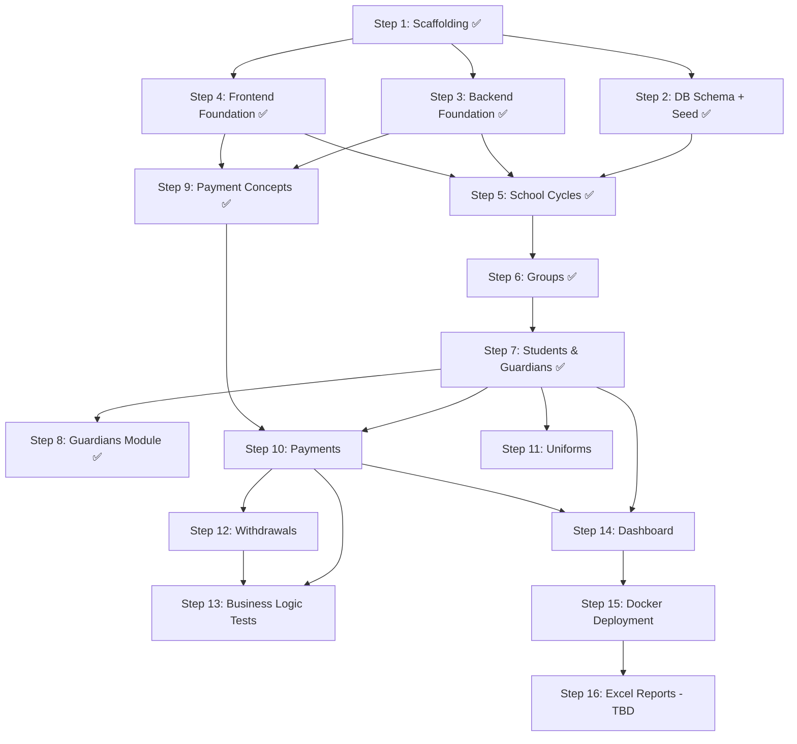

# Implementation Plan — Sistema de Gestión Escolar (Phase 1)

> **Maintenance note:** This document is the source of truth for the project plan. If the tech stack, implementation steps, business logic, or architecture change during development, update this document to reflect the current state. Keep step statuses up to date as work progresses.

## Overview

Build Phase 1 of a school management system covering: student/guardian management, group management, payment registration with recurring rules, uniforms, student withdrawals, Excel reports (TBD), and a dashboard with charts.

**Key constraints:**
- Development: Windows + local MySQL
- Deployment: macOS + full Docker Compose
- Single admin user (no roles)
- Spanish UI labels, English code/variables/comments

---

## Tech Stack Summary

| Layer | Technology |
|-------|-----------|
| Frontend | React 19 + TypeScript + Vite 8 |
| UI Library | Material UI (MUI) v7 |
| Forms | React Hook Form + Zod |
| Server State | TanStack Query (React Query) |
| Charts | Recharts |
| Backend | Node.js + Express + TypeScript |
| ORM | Prisma |
| Database | MySQL 8 |
| Validation | Zod |
| Excel Reports | TBD (requirements pending) |
| Auth | JWT + bcryptjs |
| Testing | Vitest (backend integration tests for critical business logic) |

---

## Database Schema (16 Tables)

| Table | Purpose | Key Relationships |
|-------|---------|-------------------|
| `school_cycles` | Academic year periods | Parent of groups, students, payments |
| `groups` | Student groups with level/grade/section | Belongs to cycle, contains students |
| `students` | Enrolled students | Belongs to group + cycle, has payments/uniforms |
| `guardians` | Parents/tutors | Many-to-many with students (max 4) |
| `student_guardian` | Student-guardian junction | Links students ↔ guardians |
| `fiscal_data` | Tax/billing info | One-to-one with guardian |
| `student_academic_history` | Grade history per cycle | One per student per cycle |
| `payment_concepts` | Payment type definitions | Referenced by payments |
| `recurring_payment_rules` | Auto-generation rules | Defines when payments are created |
| `payment_methods` | Standardized payment method catalog | Referenced by payment transactions |
| `payments` | Individual payment/debt records | Belongs to student + concept + cycle; has transactions |
| `payment_transactions` | Individual payment installments/receipts | Belongs to payment + method; tracks each partial payment |
| `uniform_catalog` | Available uniform items | Referenced by uniform orders |
| `uniforms` | Uniform orders/purchases | Belongs to student + catalog item |
| `withdrawals` | Student withdrawal records | One per student (optional) |
| `users` | System authentication | Single admin for Phase 1 |

> Full schema details in [data-models.md](./data-models.md)

---

## API Endpoints

### Auth (2 endpoints)
| Method | Path | Description |
|--------|------|-------------|
| POST | `/api/auth/login` | Login, returns JWT |
| GET | `/api/auth/me` | Current user info |

### School Cycles (4 endpoints)
| Method | Path | Description |
|--------|------|-------------|
| GET | `/api/school-cycles` | List all cycles |
| POST | `/api/school-cycles` | Create cycle |
| PUT | `/api/school-cycles/:id` | Update cycle |
| PATCH | `/api/school-cycles/:id/activate` | Set as active cycle |

### Groups (5 endpoints)
| Method | Path | Description |
|--------|------|-------------|
| GET | `/api/groups` | List groups (filter by cycle) |
| POST | `/api/groups` | Create group |
| PUT | `/api/groups/:id` | Update group |
| PATCH | `/api/groups/:id/empty` | Remove all students from group |
| DELETE | `/api/groups/:id` | Delete group (must be empty) |

### Students (9 endpoints)
| Method | Path | Description |
|--------|------|-------------|
| GET | `/api/students` | List students (search, filter) |
| POST | `/api/students` | Create student with guardians |
| GET | `/api/students/:id` | Student detail |
| PUT | `/api/students/:id` | Update student |
| POST | `/api/students/:id/guardians` | Add guardian to existing student (new or link existing, max 4) |
| GET | `/api/students/:id/payments` | Payment history |
| GET | `/api/students/:id/uniforms` | Uniform orders |
| GET | `/api/students/:id/debt` | Detailed debt breakdown |
| GET | `/api/students/:id/academic-history` | Academic history |

### Guardians (8 endpoints)
| Method | Path | Description |
|--------|------|-------------|
| GET | `/api/guardians` | List guardians (search, status filter: active/inactive) |
| POST | `/api/guardians` | Create guardian |
| GET | `/api/guardians/:id` | Guardian detail (includes linked students with group and guardian count) |
| PUT | `/api/guardians/:id` | Update guardian |
| POST | `/api/guardians/:id/fiscal-data` | Create/update fiscal data |
| DELETE | `/api/guardians/:id/students/:studentId` | Unlink student from guardian (guard: min 1 guardian per student) |
| PATCH | `/api/guardians/:id/students/:studentId` | Update relationship and isPrimary (auto-unsets other primaries) |
| GET | `/api/guardians/check-duplicate` | Check email/phone existence |

### Payment Concepts (3 endpoints)
| Method | Path | Description |
|--------|------|-------------|
| GET | `/api/payment-concepts` | List all concepts |
| POST | `/api/payment-concepts` | Create concept |
| PUT | `/api/payment-concepts/:id` | Update concept |

### Payment Methods (3 endpoints)
| Method | Path | Description |
|--------|------|-------------|
| GET | `/api/payment-methods` | List all payment methods |
| POST | `/api/payment-methods` | Create payment method |
| PUT | `/api/payment-methods/:id` | Update payment method |

### Payments (11 endpoints)
| Method | Path | Description |
|--------|------|-------------|
| GET | `/api/payments` | List payments (filter by student, status, cycle, month) |
| POST | `/api/payments` | Create a payment (optionally with first transaction) |
| GET | `/api/payments/:id` | Payment detail with transactions |
| PUT | `/api/payments/:id` | Update payment fields (baseAmount, discount, surcharge, dueDate, notes, status) |
| DELETE | `/api/payments/:id` | Delete payment and all its transactions |
| PATCH | `/api/payments/:id/cancel` | Cancel payment (status → cancelled, excluded from debt) |
| POST | `/api/payments/:id/transactions` | Add installment/payment transaction |
| DELETE | `/api/payments/transactions/:id` | Delete a single transaction (recalculates amountPaid) |
| POST | `/api/payments/bulk-generate` | Auto-generate mandatory payments for student/cycle |
| DELETE | `/api/payments/student/:id/reset` | Reset all payments for a student (sets debt to 0) |
| POST | `/api/payments/check-overdue` | Scan and mark overdue payments |

### Recurring Payment Rules (5 endpoints)
| Method | Path | Description |
|--------|------|-------------|
| GET | `/api/recurring-rules` | List rules |
| POST | `/api/recurring-rules` | Create rule |
| PUT | `/api/recurring-rules/:id` | Update rule |
| DELETE | `/api/recurring-rules/:id` | Delete rule (only if inactive) |
| POST | `/api/recurring-rules/generate` | Manually trigger payment generation for current month |

### Uniforms (6 endpoints)
| Method | Path | Description |
|--------|------|-------------|
| GET | `/api/uniforms/catalog` | List catalog items |
| POST | `/api/uniforms/catalog` | Add catalog item |
| PUT | `/api/uniforms/catalog/:id` | Update catalog item |
| POST | `/api/uniforms/orders` | Create uniform order (multiple items) |
| GET | `/api/uniforms/orders` | List orders (filter by student, delivery status) |
| PATCH | `/api/uniforms/orders/:id/deliver` | Mark as delivered |

### Withdrawals (2 endpoints)
| Method | Path | Description |
|--------|------|-------------|
| GET | `/api/withdrawals` | List all withdrawals |
| POST | `/api/withdrawals` | Process student withdrawal |

### Reports (TBD)
_Excel report endpoints to be defined once export requirements are finalized._

**Total: ~57 endpoints + reports TBD**

---

## Frontend Routes & Pages

| Route | Page | Sidebar Section | Description |
|-------|------|-----------------|-------------|
| `/login` | Login | — | Username + password authentication |
| `/` | Dashboard | Home | Metric cards + financial charts (recharts) |
| `/alumnos` | StudentList | Matrícula | Searchable table with debt badge; status filter (default: active only) |
| `/alumnos/nuevo` | StudentCreate | Matrícula | Multi-section form: student + up to 4 guardians + fiscal data |
| `/alumnos/:id` | StudentDetail | Matrícula | Tabbed view: Info, Pagos, Uniformes, Historial Académico; pending payments summary |
| `/tutores` | GuardianList | Matrícula | Searchable table with active/inactive badge; status filter (default: active) |
| `/tutores/:id` | GuardianDetail | Matrícula | Tabbed view: Info (editable), Datos Fiscales (editable), Alumnos Vinculados |
| `/grupos` | GroupList | Matrícula | Groups organized by cycle with student count |
| `/bajas` | WithdrawalHistory | Matrícula | List of withdrawn students with details |
| `/bajas/nueva` | WithdrawalForm | Matrícula | Student search → reason → confirmation → process |
| `/pagos` | PaymentForm | Finanzas | Student search → concept selection → amount calculation → register |
| `/pagos/historial` | PaymentHistory | Finanzas | Filterable payment table across all students |
| `/uniformes` | UniformRegistration | Finanzas | Multi-item uniform order form per student |
| `/configuracion/ciclos` | SchoolCycleManagement | Configuración | CRUD for school cycles, activate/deactivate |
| `/configuracion/conceptos` | PaymentConceptManagement | Configuración | CRUD for payment concepts |
| `/configuracion/pagos-recurrentes` | RecurringRulesManagement | Configuración | Configure recurring payment generation rules |
| `/configuracion/catalogo-uniformes` | UniformCatalog | Configuración | CRUD for uniform catalog items and prices |
| `/configuracion/metodos-pago` | PaymentMethodManagement | Configuración | CRUD for payment methods (Efectivo, Transferencia, Tarjeta) |

**Total: 18 pages**

---

## Key Business Logic

### Payment Model Architecture
- **Payment** = a debt/charge record (concept, amounts, status). Does NOT store payment method or receipt.
- **PaymentTransaction** = an individual installment/payment against a Payment. Stores amount, paymentMethodId, receiptNumber, paymentDate, notes. Each payment can have multiple transactions (partial payments).
- `Payment.amountPaid` = SUM of all its PaymentTransactions.

### Debt Calculation
```
Total Debt = SUM(final_amount - amount_paid) WHERE status IN ('pending', 'partial', 'overdue')
```
Recalculated and cached in `students.total_debt` after every payment/transaction change. Cancelled payments are excluded.

### Payment Amount Calculation
```
final_amount = base_amount × (1 - discount_percent / 100) × (1 + surcharge_percent / 100)
```

### Payment Status Logic
- `paid`: amountPaid >= finalAmount
- `partial`: amountPaid > 0 && amountPaid < finalAmount
- `overdue`: dueDate < today && amountPaid < finalAmount
- `pending`: default (no payment, not overdue)
- `cancelled`: manual only (excluded from debt)

### Bulk Payment Generation (on enrollment)
1. Find all active mandatory payment concepts
2. For each concept, check if a RecurringPaymentRule exists for that concept+cycle
3. If rule exists: use rule's startMonth, endMonth, dueDay
4. If no rule: use cycle date range for months, day 10 as default dueDay
5. Monthly concepts → one payment per month; one-time concepts → single payment
6. Skip duplicates (unique constraint: studentId + conceptId + cycleId + appliesToMonth)

### Recurring Payment Generation
1. Check active rules where current month is within `start_month` to `end_month`
2. For each rule, create pending payments for all active students in the cycle
3. Skip if payment already exists for that student/concept/cycle/month
4. Set `due_date` based on `due_day` from the rule

### Overdue Detection
- Payments with `status = 'pending'` and `due_date < TODAY` are auto-marked as `overdue`
- Can be triggered manually from PaymentHistory page

### Overpayment Prevention
- When adding a PaymentTransaction, the amount cannot exceed the remaining balance (finalAmount - amountPaid)
- Validated both in frontend (disabled submit) and backend (400 error)

### Payment Operations
- **Edit**: modify baseAmount, discountPercent, surchargePercent, dueDate, notes (recalculates finalAmount and status)
- **Cancel**: set status to cancelled (excluded from debt, transactions preserved as history)
- **Delete**: removes payment and all its transactions (cascade), recalculates debt
- **Delete Transaction**: removes a single installment, recalculates amountPaid and status

### Withdrawal Process
1. Snapshot current debt → `pending_debt_at_withdrawal`
2. Set student status → `withdrawn`
3. Create withdrawal record
4. Preserve all academic and financial history (no deletes)

### Payment Reset
- Deletes all payment records (and their transactions) for a student
- Sets `total_debt = 0`
- Requires admin confirmation (any student, no restrictions)

---

## Implementation Order

### Step 1: Project Scaffolding ✅
- Initialize monorepo with npm workspaces (root `package.json`)
- Create Vite + React + TypeScript frontend (`frontend/`)
- Create Express + TypeScript backend (`backend/`)
- Initialize Prisma with MySQL connection
- Configure ESLint, Prettier for both projects
- Create `.env.example`, `.gitignore`
- Setup `concurrently` for parallel dev servers

**Output:** Running `npm run dev` starts both frontend (`:5173`) and backend (`:3000`)

### Step 2: Database Schema + Seed ✅
- Write complete Prisma schema (all 14 tables)
- Run initial migration (`npx prisma migrate dev`)
- Create seed script with:
  - Admin user (username: `admin`)
  - Default payment concepts: Inscripción, Colegiatura (monthly), Material, Seguro
  - Sample school cycle (2025-2026)
  - Sample groups for the cycle (Kinder 1-3, Primaria 1-6, Secundaria 1-3 — sections A, B)

**Output:** Database with all tables created and seed data inserted

### Step 3: Backend Foundation ✅
- Express app setup: CORS, JSON parsing, helmet, morgan
- Error handler middleware + `AppError` class
- JWT auth middleware (simplified for single admin)
- Zod validation middleware (`validateRequest`)
- Standardized response helpers (`successResponse`, `errorResponse`)
- Auth endpoints: `POST /api/auth/login`, `GET /api/auth/me`

**Output:** Backend responds to auth endpoints, rejects unauthenticated requests

### Step 4: Frontend Foundation ✅
- MUI theme configuration (colors, typography, shadows over borders, tabular-nums)
- AppLayout component: sidebar navigation + header + content area
- React Router setup with all 16 routes
- Axios client with JWT interceptor (auto-redirect on 401)
- TanStack Query provider
- Auth context + Login page + ProtectedRoute wrapper
- Sidebar with grouped sections (Home, Matrícula, Finanzas, Configuración)

**Output:** Login works, authenticated users see the layout with navigation

### Step 5: School Cycles Module ✅
- **Backend:** CRUD endpoints for school_cycles, activation logic (deactivate others)
- **Frontend:** SchoolCycleManagement page with create/edit form and active toggle

**Dependencies:** Steps 1-4

### Step 6: Groups Module ✅
- **Backend:** CRUD endpoints for groups with level-grade validation, empty group and delete with guard, gap-formula promotionOrder
- **Frontend:** GroupList page with cycle filter, paginated table, create/edit dialog with dynamic grade options, empty/delete with confirmation

**Dependencies:** Step 5 (groups reference cycles)

### Step 7: Students & Guardians Module ✅
- **Backend:** Student CRUD, Guardian CRUD with duplicate check, student_guardian linking (max 4), fiscal_data CRUD, academic history, `noGroup` filter (students with no group assigned)
- **Frontend:**
  - StudentList: searchable table with debt column, status/cycle/group filters (including "Sin grupo"), server-side sorting
  - StudentCreate: multi-section form (student data + up to 4 dynamic guardians + collapsible fiscal data per guardian), real-time duplicate detection on blur
  - StudentDetail: tabbed view (Info with editable student/guardian/fiscal dialogs, Pagos/Uniformes placeholders, Historial Académico table)
  - DatePicker (MUI x-date-pickers + dayjs) integrated in StudentCreate, StudentDetail, and SchoolCycleManagement

**Dependencies:** Step 6 (students reference groups)

### Step 8: Guardians Module ✅
- **Backend:**
  - Extend `GET /api/guardians` with `?status=active|inactive` filter (computed: active = has at least one student with `status='active'`)
  - Add `DELETE /api/guardians/:id/students/:studentId` to unlink a student (guard: student must have more than 1 guardian)
  - Add `PATCH /api/guardians/:id/students/:studentId` to update relationship and isPrimary (auto-unsets other primaries)
- **Frontend:**
  - GuardianList (`/tutores`): paginated searchable table (name, phone, email, linked student count), active/inactive badge, status filter (default: active), server-side sorting
  - GuardianDetail (`/tutores/:id`): tabbed view (Info editable via dialog, Datos Fiscales editable via dialog, Alumnos Vinculados table with unlink — disabled when student has only 1 guardian)
  - StudentDetail: edit guardian dialog extended with relationship select and isPrimary checkbox; guardians sorted primary-first; "Agregar Tutor" button with dialog (create new or link existing via search autocomplete)
  - Sidebar: "Tutores" entry added after "Alumnos" in Matrícula section
  - StudentList: status filter defaults to active students only
  - Dev tooling: `kill-port` added to backend `dev` script to prevent zombie processes on port 3000

**Dependencies:** Step 7 (guardians reference students)

### Step 9: Payment Concepts & Methods Module ✅
- **Backend:** CRUD endpoints for payment_concepts and payment_methods
- **Frontend:** PaymentConceptManagement page, PaymentMethodManagement page

**Dependencies:** Steps 1-4

### Step 10: Payments Module
Divided into 8 sub-modules (10A–10H), implemented sequentially.

#### Sub-module 10A: Prisma Migration + Debt Service
- Add `payment_transactions` table to Prisma schema (tracks individual installments)
- Remove `paymentMethodId` and `receiptNumber` from `payments` table (moved to transactions)
- Create `debt.service.ts`: calculateFinalAmount, determinePaymentStatus, recalculateAmountPaid, recalculateStudentDebt

#### Sub-module 10B: Backend Payment CRUD
- Full Payment CRUD: list (with filters), getById, create, update, remove, cancel
- PaymentTransaction endpoints: addTransaction, removeTransaction
- bulkGenerateMandatory: auto-generate payments on enrollment (uses RecurringPaymentRule config if exists, fallback to cycle range + day 10)
- resetStudentPayments: delete all payments + set debt to 0
- checkOverdue: mark pending payments with past due dates as overdue
- Replace student controller placeholders (getPayments, getDebt)
- Hook bulkGenerateMandatory into student enrollment flow

#### Sub-module 10C: Backend Recurring Rules CRUD
- CRUD for recurring_payment_rules (delete only if inactive)
- generatePayments: create pending payments for current month for all active students in cycle

#### Sub-module 10D: Frontend Types + API + Hooks
- TypeScript interfaces for Payment, PaymentTransaction, RecurringPaymentRule, DebtBreakdown
- Axios API clients and React Query hooks for all endpoints

#### Sub-module 10E: Frontend PaymentForm (`/pagos`)
- Two explicit modes (tabs): "Pagar deuda existente" and "Nuevo pago"
- Pagar deuda: student search → pending payments table → select payment → enter installment amount (max = remaining balance) → payment method → receipt → save → creates PaymentTransaction
- Nuevo pago: student search → concept select → discount/surcharge → auto-calc finalAmount → payment amount → method → receipt → save → creates Payment + first Transaction
- Post-save dialog: "¿Otro pago al mismo alumno?" → Yes: keep student / No: navigate to history

#### Sub-module 10F: Frontend PaymentHistory (`/pagos/historial`)
- Filterable table: student search, status dropdown, cycle dropdown
- Status chips (color-coded), sortable columns, pagination
- "Verificar Vencidos" button (triggers overdue check)
- Click row → detail dialog: payment info + transactions table (with delete per transaction) + edit/cancel/delete payment actions

#### Sub-module 10G: Frontend StudentDetail Payments Tab
- Debt summary card (total) + breakdown table by concept (total owed, paid, balance)
- Paginated payments table (click for detail with transactions)
- "Generar Pagos Obligatorios" button + "Resetear Pagos" button (with irreversible ConfirmDialog)

#### Sub-module 10H: Frontend RecurringRulesManagement (`/configuracion/pagos-recurrentes`)
- Sortable/paginated table with concept and cycle names, month names in Spanish
- Create/edit dialog with concept + cycle dropdowns, day inputs, month selects, optional amount override
- Delete only inactive rules (with irreversible confirmation)
- "Generar Pagos Ahora" button (current month, shows result count)

**Dependencies:** Steps 7, 9 (payments reference students + concepts)

### Step 11: Uniforms Module
- **Backend:** Catalog CRUD, order creation (multiple items), delivery marking
- **Frontend:**
  - UniformCatalog: CRUD page
  - UniformRegistration: multi-item order form with student search
  - Uniform tab in StudentDetail
  - Pending delivery indicators

**Dependencies:** Step 7 (uniforms reference students)

### Step 12: Withdrawals Module
- **Backend:** Withdrawal processing (status change + debt snapshot), listing
- **Frontend:**
  - WithdrawalForm: student search → reason → ConfirmDialog → process
  - WithdrawalHistory: DataGrid with withdrawn students

**Dependencies:** Step 10 (withdrawal snapshots debt)

### Step 13: Business Logic Tests (Vitest)
- Install `vitest` as backend devDependency
- Add `test` and `test:watch` scripts to `backend/package.json`
- Write integration tests for critical pure business logic functions:
  - **Debt calculation** (`debt.service.ts`): verify `calculateTotalDebt` correctly sums pending/partial/overdue payments, ignores paid/cancelled
  - **Payment amount calculation** (`payment.service.ts`): verify `calculateFinalAmount` applies discount and surcharge formula correctly
  - **Recurring payment month range** (`recurringPayment.service.ts`): verify `shouldGenerateForMonth` handles same-year ranges, year-wrapping ranges (Aug→Jun), edge cases
  - **Withdrawal validation** (`withdrawal.service.ts`): verify `buildWithdrawalRecord` snapshots debt and rejects already-withdrawn students
- Tests target **exported pure functions only** (no DB, no mocks, no HTTP)
- Test files located in `backend/src/services/__tests__/`

**Dependencies:** Steps 10, 12 (services must be implemented first)
**Output:** `npm run test --workspace=backend` passes ~15-20 tests

### Step 14: Dashboard
- **Backend:** Aggregation endpoints (total students, payment summaries, monthly breakdowns)
- **Frontend:**
  - Metric cards: total active students, pending payments (count + amount), total debt, recent enrollments
  - Charts (recharts): monthly income bar chart, debt trend line chart, payment status pie chart

**Dependencies:** Steps 7, 10 (dashboard aggregates student and payment data)

### Step 15: Docker Deployment
- Backend Dockerfile (Node.js, runs Prisma migrations on startup)
- Frontend Dockerfile (multi-stage: build React + serve with nginx)
- `docker-compose.yml` with three services: `mysql`, `backend`, `frontend`
- nginx config to proxy `/api/*` to backend
- `.env.production` configuration
- Persistent MySQL volume

**Output:** `docker compose up` starts the full application on macOS

### Step 16: Excel Reports
_Requirements pending — export content and format to be defined._

**Dependencies:** TBD

---

## Dependency Graph



---

## Verification Plan

### Per-Step Verification

| Step | Verification |
|------|-------------|
| 1 ✅ | `npm run dev` starts both servers without errors |
| 2 ✅ | `npx prisma migrate dev` creates 14 tables; `npx prisma db seed` inserts default data |
| 3 ✅ | `POST /api/auth/login` returns JWT; protected endpoints reject unauthenticated requests |
| 4 ✅ | Login page works; authenticated users see sidebar layout; navigation routes render |
| 5 ✅ | Create/edit/activate school cycles via UI |
| 6 ✅ | Create groups, see student counts, filter by cycle |
| 7 ✅ | Create students with guardians, search, view detail, duplicate guardian detection works |
| 8 ✅ | List guardians with active/inactive badge, filter by status, view/edit detail with tabs, unlink students, edit relationship/isPrimary, add guardian to existing student (new or link existing) |
| 9 | Create/edit payment concepts via UI |
| 10 | Register payments, verify debt updates, test bulk generation, recurring rules, overdue detection, payment reset |
| 11 | Create uniform orders, mark as delivered, verify catalog CRUD |
| 12 | Process withdrawal, verify debt snapshot, student status changes, history preserved |
| 13 | `npm run test --workspace=backend` — all ~15-20 tests pass for debt, payment calculation, recurring rules, withdrawal |
| 14 | Dashboard shows correct metrics and charts |
| 15 | `docker compose up` on macOS starts all services; full workflow works |
| 16 | Excel reports — verification TBD |

### End-to-End Integration Test

1. Login as admin
2. Create school cycle "2025-2026" → activate it
3. Create groups: Kinder 1-A, 1-B, 2-A
4. Set up recurring payment rules (tuition: generate day 1, due day 10, Aug-Jun)
5. Register student with 2 guardians (one with fiscal data)
6. Verify mandatory payments were auto-generated
7. Register a tuition payment → verify debt decreases
8. Order uniforms → mark one as delivered
9. Process student withdrawal → verify debt snapshot preserved
10. Check dashboard metrics and charts reflect the data
11. Reset a student's payments → verify debt is 0
